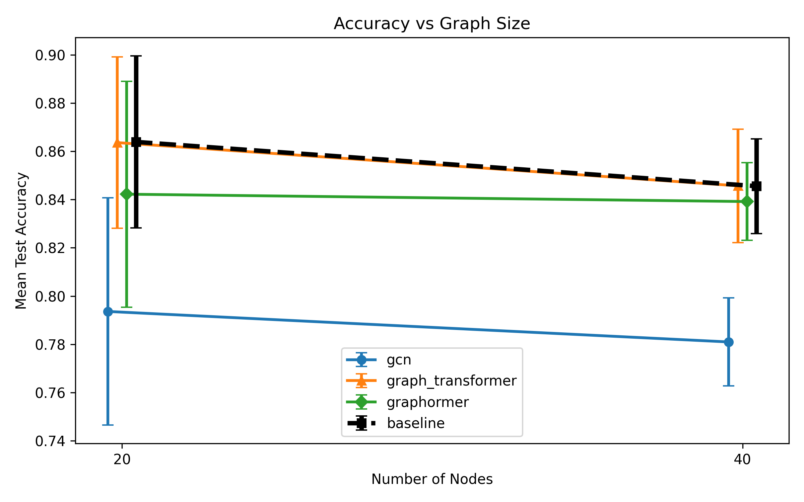
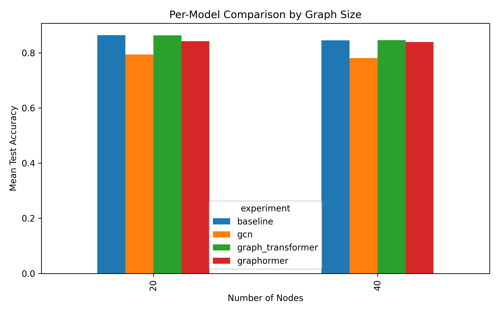
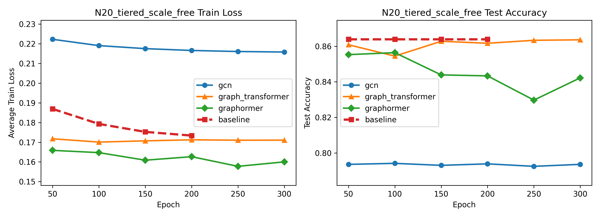
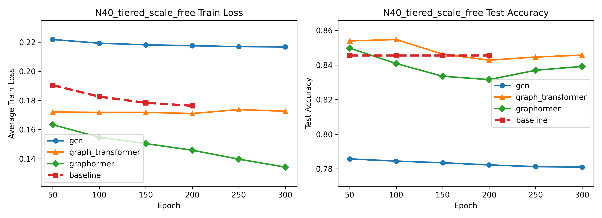

# Research Status

## Project Question
Can graph-based neural architectures improve next-step disruption prediction in directed synthetic supply-chain networks relative to a feature-only baseline?

## Current Setup
- Graph family: `tiered_scale_free`
- Edge semantics: directed
- Main graph sizes studied: `N20`, `N40`
- Seeds currently aggregated: `1, 2, 3`

## Data Generation
- Graphs are generated as directed tiered scale-free supply-chain networks.
- Node states evolve through:
  - exogenous shock
  - endogenous propagation
  - probabilistic recovery

## Input Features
- `health`: current operating/disrupted state
- `exposure`: disruption pressure from upstream neighbors
- `time_to_recovery`: disruption duration proxy
- `betweenness centrality`: added in memory for Graphormer only

## Models Compared
- Baseline: feature-only node classifier
- GCN: adjacency-based local message passing
- Graph Transformer: masked local self-attention
- Graphormer: global attention with structural bias

## Current Main Results
### N20 tiered_scale_free, seeds = 1, 2, 3
- Baseline: `0.8639 +/- 0.0356`
- GCN: `0.7936 +/- 0.0471`
- Graph Transformer: `0.8636 +/- 0.0356`
- Graphormer: `0.8422 +/- 0.0468`

### N40 tiered_scale_free, seeds = 1, 2, 3
- Baseline: `0.8456 +/- 0.0196`
- GCN: `0.7810 +/- 0.0182`
- Graph Transformer: `0.8457 +/- 0.0235`
- Graphormer: `0.8392 +/- 0.0161`

## Main Interpretation
- GCN is consistently weaker than the baseline and transformer variants.
- The masked Graph Transformer is essentially tied with the baseline.
- Graphormer is competitive but does not currently outperform the baseline.
- Current evidence suggests important relational information is already encoded in node-level features, especially `exposure`.

## Current Conclusion
In the present simulator and feature design, graph transformer architectures do not yet show a decisive advantage over a strong feature-only baseline. The main insight is not that graph models fail in general, but that their incremental value is limited when relational effects are already heavily encoded through feature engineering.

## Figures
Figure 1. Accuracy vs graph size.

Figure 2. Per-model comparison by graph size.

Figure 3. Training curves for `N20_tiered_scale_free`.

Figure 4. Training curves for `N40_tiered_scale_free`.

## Key Files
- `PAPER_PREP.md`
- `EXPERIMENT_LOG.md`
- `DRAFT_PAPER.md`
- `runs/results_summary.csv`
- `runs/figures/results_by_model_size.csv`

## Next Steps
- Add more graph sizes and seeds if needed
- Consider ablation experiments on `exposure`
- Consider settings where graph structure is less pre-encoded in node features
- Decide whether to continue this line or pivot to a stronger graph-dependent setup
